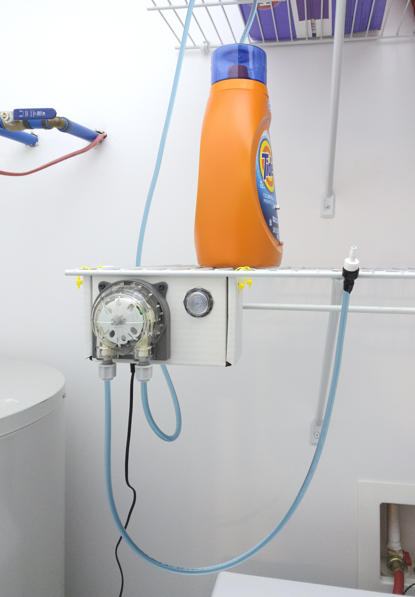

# Detergent Dispenser

HE laundry detergent is quite concentrated and front loading washing machines
use really little water. With those two factors put together, it's really easy
to put too much detergent and so soap will be left even after the rinse cycle.

This project aim to automate the dispensing of a precise amount of detergent.

## Board

## Assembled Unit

After holding the button for 1 seconds, the pump will dispense 7.5ml of
detergent. This has been empirically determined to be the required amount
for a small load on our dishwasher using our usual soap.

## Installed

The pump feeds directly from the bottle.

### Resource Efficiency

The bottle in this picture is rated for 44 loads but with the proper quantity determined for our specific case along with precise dispensing, we will get over 250 loads from this bottle.

(272 small loads of 7.5ml)

## Next Steps

A couple improvements could be done to this project.

1. The output of the dispenser could be permanently mounted to the washing
machine soap compartment.

2. In normal mode, the esp32 uses quite a lot of power and this translates to
a power regulator hovering just under 70C in normal operation. As the device
does nothing most of the time, power management could be added so the regulator
doesn't have to dissipate that much power.

3. The ground/power doesn't seem to be so stable on the board as touching the
pins can sometime trigger a button press or a glitch on the pump sync signal.
This doesn't seem to be too much of an issue when the device is assembled in
the case.
